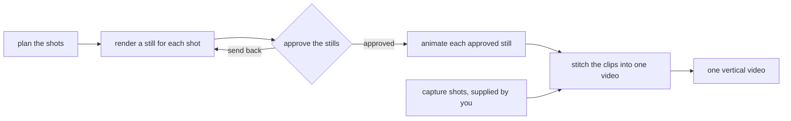

# reel-stitch

Reel Stitch turns one line of an idea into a short vertical video. It runs on your own machine,
with open models, through Draw Things. It plans the shots and renders one still for each
shot. It waits for you to approve those stills. Then it animates the approved ones and cuts the
clips together. One reel is one directory that holds a `reel.json` file and the media that file
names.

## The pipeline

Approval is a gate. Nothing animates until you approve the still for that shot. A clip costs
about 40 times a still, so the gate is where a mistake is cheap to find.

Capture shots skip the first four steps. You supply the file, and it enters at the stitch step.

## Documents

- [docs/setup.md](docs/setup.md). Install the renderer and the models, verify one still, and read
  the four known traps.
- [docs/prompts.md](docs/prompts.md). The eight prompt rules, each with the failure that produced
  it, and the standard negative prompt.
- [docs/measurements.md](docs/measurements.md). Every measured number, with the machine, the
  software versions and the date beside it.
- [docs/manifest.md](docs/manifest.md). The `reel.json` contract that every command reads and
  writes.
- [docs/commands.md](docs/commands.md). The commands, their flags, the paths they write and the
  exit codes they return.
